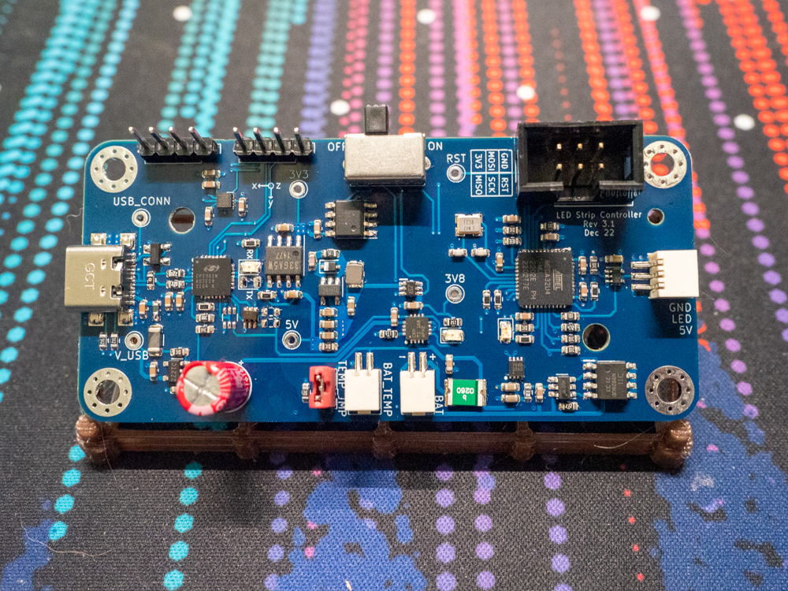
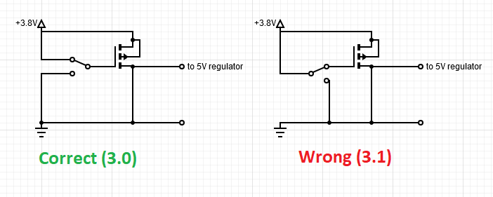

# LED Strip Controller
## Summary
I'm working on a hardware and software project from scratch to create an addressable LED strip controller with 1S Li-Ion battery charging and an 8-bit AVR microcontroller. I'm not done yet, and currently on hardware revision 3.1.

## Motivation
I started this project because I wanted to learn how to program a microcontroller from scratch, without using Arduino libraries. I've gone through the whole process of creating a product - designing the schematics, choosing components, making and assembling the PCB, programming, and designing the enclosure.

## Hardware Revisions
I've made a few changes to the hardware along the way, mostly related to layout or component selection.

### Rev 1.0 (ATMEGA328PB)

This was my first time using SMD components, so I went with 0806. I also tried using a frying pan as a hotplate and you can see some burnt flux, but the connections are okay. U7 (the 3V3 to 5V level shifter) is missing because I ordered the wrong component by accident. I also realized that the USB-C connector had to be hand-soldered because I put it on the bottom of the board.

I got the new level shifter and also soldered in the through-hole components. You can see that the board is covered in flux residue, even though I tried to clean it in an isopropyl alcohol bath. I couldn't get the USB-C connector to solder, even with a hot air gun, and the board never powered on.

### Rev 1.1 (ATMEGA328PB)

The biggest change was moving all the components to the top of the board. I also lengthened the important USB-C pads in case I needed to touch them up with an iron (luckily I didn't). I was able to program the MCU, but there was a problem with the USB-to-serial bridge and the USB switching IC (I used a jumper wire to bypass the switch).

### Rev 2.0 (ATSAMD21)

I wasn't happy with the cost of FTDI chips, so I redesigned the board to use an ATSAMD21 and make it simpler. But while the PCBs were being made, I couldn't get a J-Link EDU, so I had to switch to a different MCU.

### Rev 3.0 (ATMEGA32U4)

I had a good experience with the Pololu USB AVR Programmer (ISP), so I went with the ATMEGA32U4. I also felt confident enough in my soldering to switch to 0603 components. Unfortunately I made a mistake by using P-channel MOSFETs with the AP9101CK6 battery protection IC instead of N-channel MOSFETs, but USB power worked.

### Rev 3.1 (ATMEGA32U4)

#### Changes
I thought implementing USB would be simple because of the ATMEGA32U4’s USB capability, but I was wrong. Once I realized that I would need to use a lot of flash on a USB stack (e.g. LUFA) I decided to go back to using a dedicated USB-UART bridge (CP1202N), which also gave me USB current detection.
I also changed the JST connectors to Molex Pico-SPOX, which are easier and cheaper to find, and added an 18650 holder.

#### Problems
This revision passed the smoke test, but the 5V and 3V3 supplies weren’t working.
I initially thought it was a problem with the soldering on the MOSFET near the CP1202N and tried reflowing the solder joints  (notice some missing components due to a hot air mishap), but it didn't fix the issue.
I eventually tracked down a short between 3V8 (output of BQ24072) and GND - at some point between revision 3.0 and 3.1 I had swapped arounds some pins on the on/off switch and inadvertently created a short (see schematic). I was able to salvage things by de-soldering the switch and bypassing it entirely.
I also discovered that I had connected CP1202N's VDD/VREGIN pins to 3V3 instead of VBUS, but as a workaround I cut the traces and am using a jumper wire to power the IC, but this isn't an issue when running on just battery power.

## Schematics
Todo: cleanup + publish schematic

## Code
[GitHub](https://github.com/texruska/led_strip_controller)
