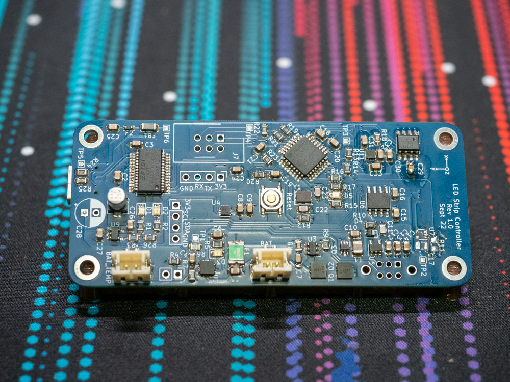
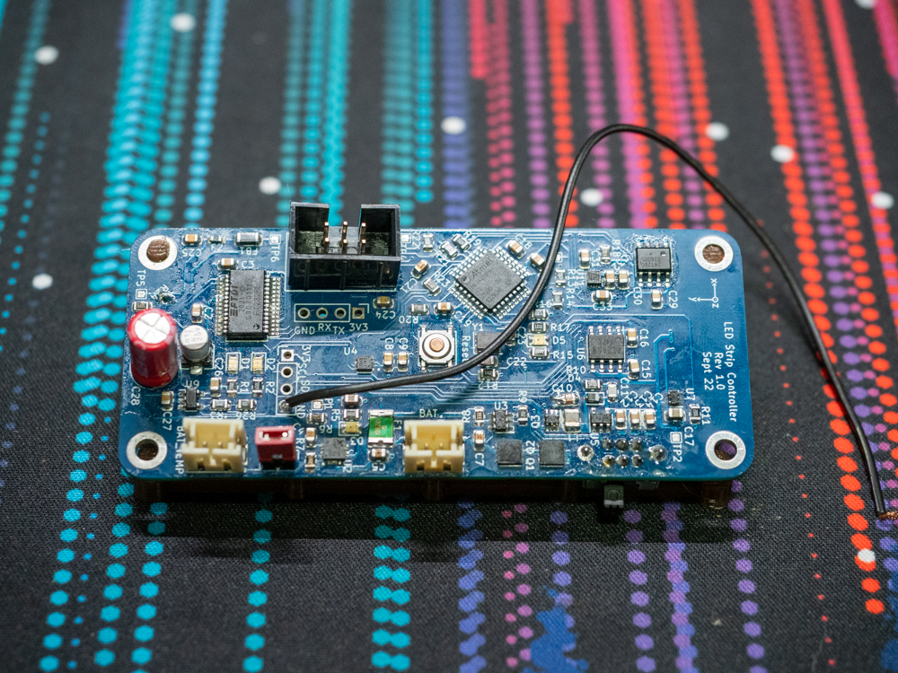

# LED Strip Controller
## Summary
Hardware + software project (from scratch)
Addressable LED strip controller with 1S Li-Ion battery charging, controlled by an 8-bit AVR microcontroller
Not yet finished, currently on hardware revision 3.0

## Motivation
I started rollerblading in July 2022 and saw somebody with LEDs attached to their skates. This project started as an excuse to learn how to program a microcontroller from scratch (i.e. no Arduino libraries). I ended up going through the entire product lifecycle -- schematic design, component selection, PCB manufacture and assembly, programming, and enclosure design.

## Hardware Revisions
The schematics went through some iterations, but didn't change significantly once it was first finished. Hardware revisions were mostly changes to layout, or component selection.

### Rev 1.0 (ATMEGA328PB)

First time working with SMD components, so I chose 0806. I also decided to try using a frying pan as a hotplate; if you look closely you can see where some of the flux has burnt slightly, but the electrical connections were still okay. U7 (3V3 to 5V level shifter) is missing because I ordered one with a different footprint by accident. It was also at this stage that I realised that putting the USB-C connector on the bottom meant that I had to hand-solder it.

I waited for the new level shifter to arrive, and this time I populated the through-hole parts too. You can see that the board is covered in flux residue, even after a huge amount of effort to clean it off. I couldn't successfully solder the USB-C connector, even with a hot air gun, and this board never powered on successfully.

### Rev 1.1 (ATMEGA328PB)

The biggest change was that I moved all components to the top, and I increased the length of the important USB-C pads just incase I needed to do any touchups with an iron (thankfully I didn't). I was able to program the MCU, but there was a problem with the USB-to-serial bridge and the USB switching IC (the jumper wire going off-image was for bypassing the switch).

### Rev 2.0 (ATSAMD21)

I wasn't satisfied with the cost of FTDI chips, and I wanted to simplify the board so I redesigned it to use an ATSAMD21. I had to change my mind while the PCBs were in transit because I found it impossible to get a J-Link EDU.

### Rev 3.0 (ATMEGA32U4)

I was having a good experience using the Pololu USB AVR Programmer (ISP), so I went for the ATMEGA32U4. I had also dialed in my soldering to the point that I felt comfortable switching to 0603 components. This is the current latest hardware revision, and so far it's working with no issues identified yet.
I haven't yet tried to use a battery (planning on using a 18650), and I can almost gurantee that I'll be changing the JST 3+4 pin connectors because of how difficult they are to buy and because I expect that the supported wire gauges will be too small for the current I expect to draw.

## Schematics
Todo: cleanup + publish schematic

## Code
Todo: publish to GitHub
